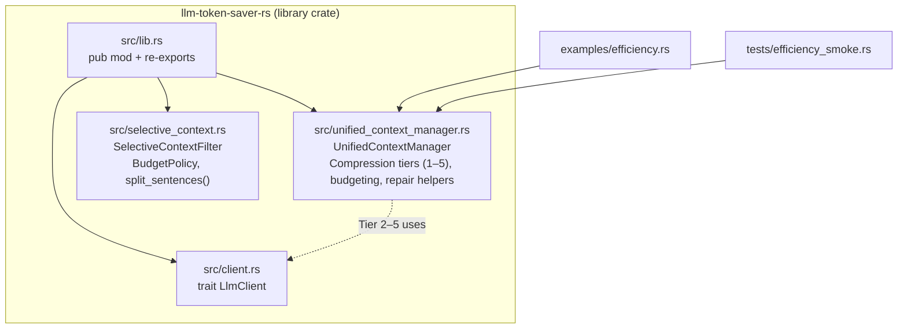

# llm-token-saver-rs

Rust crate for reducing LLM token consumption in production applications.

This crate is extracted from `snailer.ai` (AI coding agent; 5.4K+ downloads). In production we reduced average token usage by ~30–40% while maintaining response quality.

## Status
- Alpha: API may change.
- Implemented today:
  - Context compression (Tier 1–5) with tool-call integrity helpers
  - Dynamic truncation & hard-cap budgeting
  - Token estimation utilities (heuristic)
  - Selective context filtering for long text blobs (files/search results)
- Roadmap (not implemented yet in this repo): prefix/context caching, playbook-style token injection, provider integrations.

## Structure (current)

```text
llm-token-saver-rs/
  Cargo.toml
  README.md
  src/
    lib.rs                     # public API (re-exports)
    client.rs                  # trait LlmClient
    unified_context_manager.rs # UnifiedContextManager + compression tiers/budgeting
    selective_context.rs       # SelectiveContextFilter + BudgetPolicy + split_sentences()
  examples/
    efficiency.rs              # deterministic Tier 1 demo
  tests/
    efficiency_smoke.rs        # basic invariants/smoke tests
```


## The Guides

This repo is the raw code only. The guides explain everything.

<table>
  <tr>
    <td align="center" width="50%">
      <a href="[https://x.com/YOUR_HANDLE/status/YOUR_SHORTHAND_ARTICLE_ID](https://x.com/america_snail/status/2015123590430306476?s=20)">
       

      </a>
    </td>
  </tr>
  <tr>
    <td align="center">
      <h3><a href="[https://x.com/YOUR_HANDLE/status/YOUR_SHORTHAND_ARTICLE_ID](https://x.com/america_snail/status/2015123590430306476?s=20)">(Shorthand Guide)</a></h3>
      Setup, foundations, Concept, etc <b>Read this first.</b>
    </td>
  </tr>
</table>
